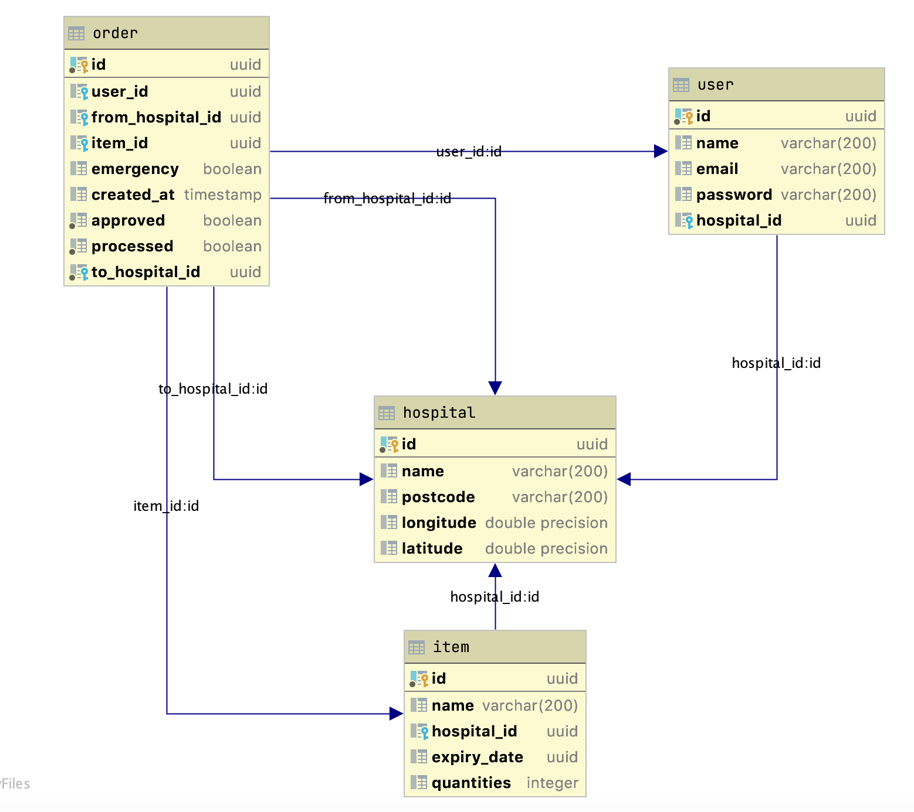

# LocAid
An innovative app to facilitate equipment and supply sharing between hospitals, especially in times of high patient volume when the need for equipment is most dire.

# Project Description
LocAid is an application that helps hospitals to request the resources in need in realtime.
User Story A: User can register their hospitals with available resources
User Story B: User can request the lacking resources sorted by nearest distance to their hospitals

# Folder structure
```bash
├── .env
├── src
│   ├── data_layer
│   ├── logic_layer
│   ├── endpoints
│   ├── models
│   ├── schemas
│   └── utils
├── tests (WIP)
├── Dockerfile
├── LICENSE
├── README.md
└── requirements.txt
```

# How to run the application
`docker build . -t locaid_bot `   
`docker run -d --name locaid -p 5000:5000 -t locaid_bot`

# Find API contract on Swagger


# Database diagram


# Running API
Go to `http://52.247.127.81:5000/docs` to see Swagger document